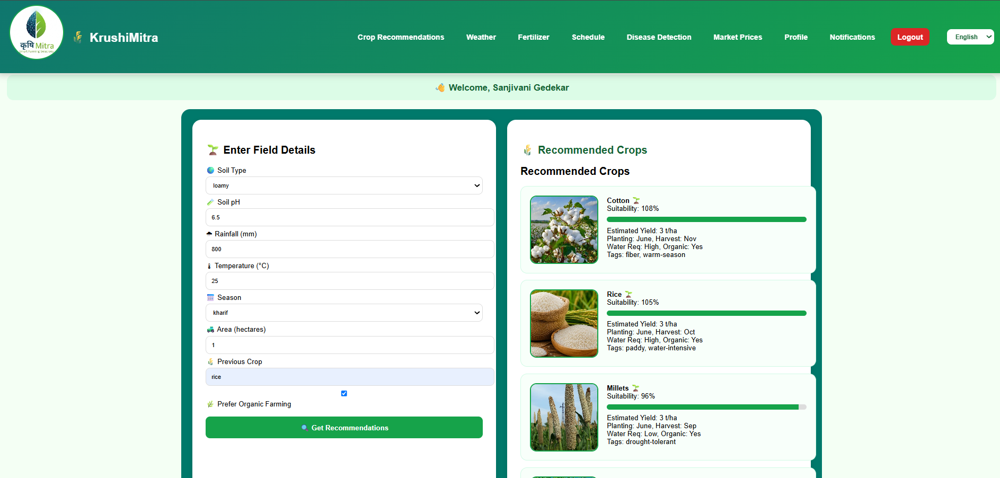
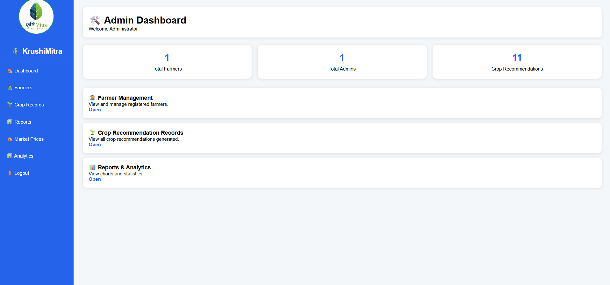
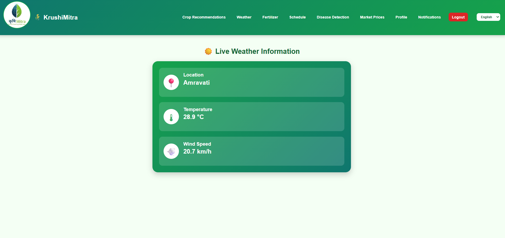

# 🌾 KrushiMitra – Smart Farming Management System

KrushiMitra is a web-based farming management platform designed to help farmers manage agricultural activities efficiently. The system provides crop recommendations, weather information, disease detection, market price updates, fertilizer guidance, and farm scheduling through a user-friendly interface.

---

## 🚀 Features

### 👨‍🌾 Farmer Module
- Farmer Registration & Login
- Crop Recommendation System
- Live Weather Information
- Disease Detection
- Fertilizer Guidance
- Market Price Updates
- Farming Schedule Management
- Notifications
- Profile Management

### 🛠️ Admin Module
- Secure Admin Login
- Farmer Management
- Crop Recommendation Records
- Market Price Management
- Analytics Dashboard
- Reports & Statistics

---

## 🖥️ Technologies Used

### Frontend
- HTML5
- CSS3
- JavaScript

### Backend
- PHP

### Database
- MySQL

### APIs
- Open-Meteo Weather API
- OpenStreetMap (Nominatim)

---

## 📂 Project Structure

```text
KrushiMitra/
│
├── admin/
│   ├── admin_dashboard.php
│   ├── admin_login.php
│   └── login.html
│
├── php/
│   ├── db_connect.php
│   ├── save_crop.php
│   ├── disease_detection.php
│   ├── market_prices.php
│   ├── fertilizer.php
│   ├── profile.php
│   └── notifications.php
│
├── images/
│
├── dashboard.php
├── login.html
├── farmer_register.html
├── index.html
└── README.md
```

---

## 🌟 Key Modules

### 🌱 Crop Recommendation
Provides suitable crop suggestions based on:
- Soil Type
- Soil pH
- Rainfall
- Temperature
- Season
- Farming Area

### 🌦 Weather Information
Displays:
- Current Temperature
- Wind Speed
- Location-Based Weather Data

### 🦠 Disease Detection
Helps farmers identify crop diseases and view possible solutions.

### 💰 Market Prices
Provides crop market prices to support better selling decisions.

### 📅 Farm Schedule
Allows farmers to manage and track agricultural activities.

---

## ⚙️ Installation Guide

### 1. Clone Repository

```bash
git clone https://github.com/yourusername/KrushiMitra.git
```

### 2. Move Project

Place the project inside:

```text
C:\xampp\htdocs\
```

### 3. Start XAMPP

Start:
- Apache
- MySQL

### 4. Create Database

```sql
CREATE DATABASE krushimitra_new;
```

### 5. Import Database

Import the provided SQL file using phpMyAdmin.

### 6. Run Project

Open:

```text
http://localhost/farm
```

---

 ## 📸 Screenshots

### Homepage


### Farmer Dashboard


### Admin Dashboard


### Weather Page

---

## 🎯 Project Objectives

- Support farmers with digital farming tools.
- Improve agricultural decision-making.
- Provide weather and market information.
- Simplify farm activity management.
- Create a centralized farming platform.

---

## 👩‍💻 Developed By

 - **Sanjivani Gedekar**
- **Saiyad Naved**
- **Vaishnavi Solav**
- **Sarthak Solav**
B.Tech – Computer Science & Engineering  
P.R. Pote Patil College of Engineering & Management, Amravati

---

## 📄 License

This project is developed for educational and academic purposes.

---

⭐ If you like this project, consider giving it a star on GitHub! 
